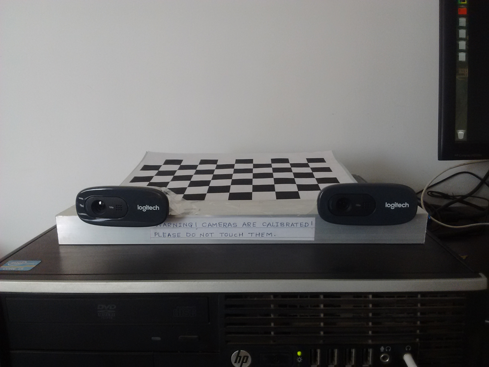

# Stereo Vision
Distance measurement using Stereo Vision. This project mesaures the distance of an object using opencv stereo vision and python.

## Installations and Setup:
Stereo Camera Rig:
 <p align="center">
  
 </p>

 ``` bash
 # Add conda to python2 path:
 export PATH=~/anaconda2/bin:$PATH
 
 # Download opencv package (2.4.13):
 conda install -c dhaneshr opencv  
 
 # Install other dependencies:
 conda install progressbar
 conda install simplejson
 
 sudo add-apt-repository ppa:zarquon42/meshlab
 sudo apt-get update
 sudo apt-get install meshlab

 # Test Webcams:
 python show_webcams.py -h
 python show_webcams.py 0 1
 
 # Take images for calibration:
 python capture_chessboards -h
 python capture_chessboards.py --rows 6 --columns 9 --square-size 2.5 --calibration-folder calibration_files 0 1 50 calibration_images
 ```
 <p align="center">
  
 </p>
 
 ```bash
 # Calibrate cameras using calibration_images:
 python calibrate_cameras.py -h
 python capture_chessboards.py --rows 6 --columns 9 --square-size 2.5 --calibration-folder calibration_files 0 1 50 calibration_images
 # Error Note: If we do not hold the chessboard as 6x9 style(horizontally) it will not be able to calibrate the vertically captured image
 
 

# Note: Above command will list down the required parameters for capturing the images of chessboard

# We need to pass the following arguments with the above command:
capture_chessboards --rows 6 --columns 9 --square-size 2.5 --calibration-folder calibrated_files 0 1 50 calibrated_images

# Now to generate files for calibration:
time calibrate_cameras --rows 6 --columns 9 --square-size 2.5 calibrated_images/ calibrated_files/

# tuning blockmatcher:
sudo pip install simplejson
tune_blockmatcher -h


```
